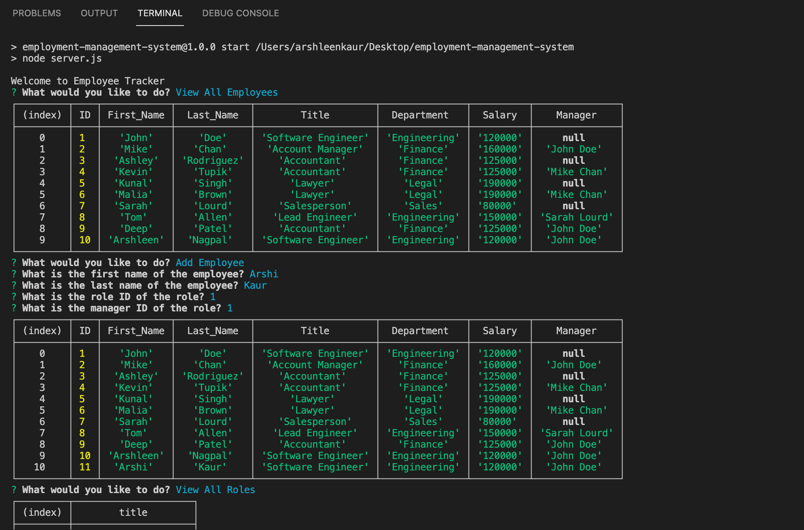

# 12 SQL: Employee Tracker

## Project Description

This application is a command-line application to manage a company's employee database, using Node.js, Inquirer, and MySQL.

## User Story

```md
AS A business owner
I WANT to be able to view and manage the departments, roles, and employees in my company
SO THAT I can organize and plan my business
```

## Screenshot

The following image shows the Team Profile Generator application's appearance and functionality:




walkthrough video link that demonstrates applications functionality: 
<https://watch.screencastify.com/v/RedXnH1BPgt7dKJoCBd6>
>

The URL of the GitHub repository is: 
<https://github.com/ArshleenKNagpal/employment-management-system>

---
© 2021 Trilogy Education Services, LLC, a 2U, Inc. brand. Confidential and Proprietary. All Rights Reserved.
